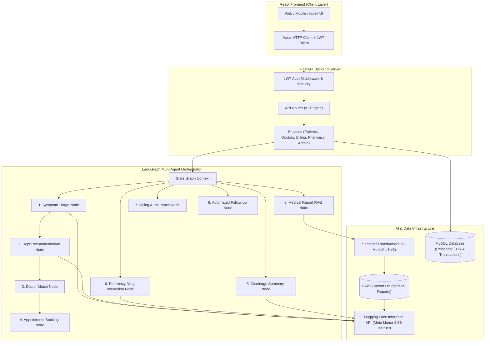
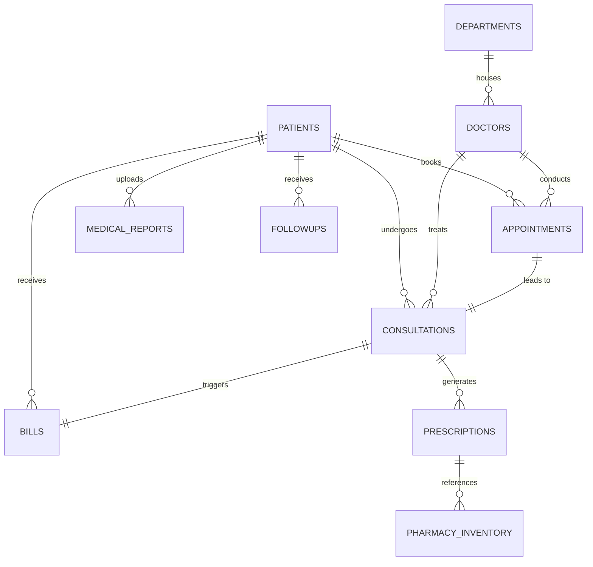
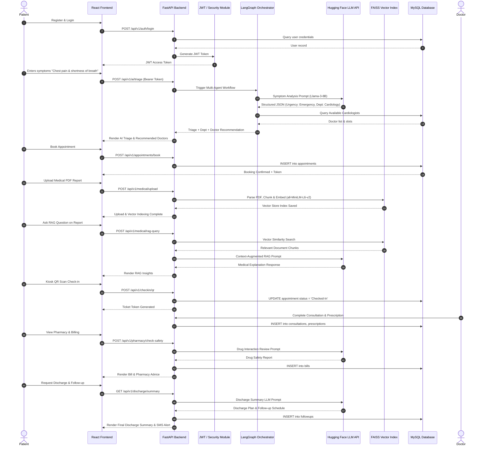

# 🏥 Hospital Agentic AI System — Comprehensive Architecture & 17-Step Technical Blueprint

---

## 📐 System Architecture Overview



---

## 🗄️ Database Schema & ER Diagram

### Entity-Relationship Diagram (ERD)



### Complete SQL DDL Schema (`schema.sql`)

```sql
-- Create Database
CREATE DATABASE IF NOT EXISTS hospital_ai_db;
USE hospital_ai_db;

-- 1. Departments Table
CREATE TABLE IF NOT EXISTS departments (
    id INT AUTO_INCREMENT PRIMARY KEY,
    name VARCHAR(100) NOT NULL UNIQUE,
    code VARCHAR(20) NOT NULL UNIQUE,
    description TEXT,
    floor_location VARCHAR(50),
    created_at TIMESTAMP DEFAULT CURRENT_TIMESTAMP
);

-- 2. Patients Table
CREATE TABLE IF NOT EXISTS patients (
    id INT AUTO_INCREMENT PRIMARY KEY,
    full_name VARCHAR(100) NOT NULL,
    age INT NOT NULL,
    gender ENUM('Male', 'Female', 'Other') NOT NULL,
    phone VARCHAR(20) NOT NULL UNIQUE,
    email VARCHAR(100) NOT NULL UNIQUE,
    password_hash VARCHAR(255) NOT NULL,
    address TEXT,
    insurance_provider VARCHAR(100),
    insurance_policy_number VARCHAR(50),
    created_at TIMESTAMP DEFAULT CURRENT_TIMESTAMP
);

-- 3. Doctors Table
CREATE TABLE IF NOT EXISTS doctors (
    id INT AUTO_INCREMENT PRIMARY KEY,
    full_name VARCHAR(100) NOT NULL,
    department_id INT NOT NULL,
    specialization VARCHAR(100) NOT NULL,
    experience_years INT NOT NULL,
    rating DECIMAL(3,2) DEFAULT 5.0,
    available_slots JSON NOT NULL,
    created_at TIMESTAMP DEFAULT CURRENT_TIMESTAMP,
    FOREIGN KEY (department_id) REFERENCES departments(id) ON DELETE CASCADE
);

-- 4. Appointments Table
CREATE TABLE IF NOT EXISTS appointments (
    id INT AUTO_INCREMENT PRIMARY KEY,
    patient_id INT NOT NULL,
    doctor_id INT NOT NULL,
    appointment_date DATE NOT NULL,
    appointment_time VARCHAR(20) NOT NULL,
    status ENUM('Scheduled', 'Checked-In', 'Completed', 'Cancelled') DEFAULT 'Scheduled',
    symptoms_summary TEXT,
    triage_urgency VARCHAR(20),
    token_number VARCHAR(20) UNIQUE,
    created_at TIMESTAMP DEFAULT CURRENT_TIMESTAMP,
    FOREIGN KEY (patient_id) REFERENCES patients(id) ON DELETE CASCADE,
    FOREIGN KEY (doctor_id) REFERENCES doctors(id) ON DELETE CASCADE
);

-- 5. Medical Reports Table
CREATE TABLE IF NOT EXISTS medical_reports (
    id INT AUTO_INCREMENT PRIMARY KEY,
    patient_id INT NOT NULL,
    file_name VARCHAR(255) NOT NULL,
    file_path VARCHAR(255) NOT NULL,
    vector_index_id VARCHAR(100),
    summary TEXT,
    uploaded_at TIMESTAMP DEFAULT CURRENT_TIMESTAMP,
    FOREIGN KEY (patient_id) REFERENCES patients(id) ON DELETE CASCADE
);

-- 6. Consultations Table
CREATE TABLE IF NOT EXISTS consultations (
    id INT AUTO_INCREMENT PRIMARY KEY,
    appointment_id INT NOT NULL UNIQUE,
    patient_id INT NOT NULL,
    doctor_id INT NOT NULL,
    diagnosis TEXT NOT NULL,
    clinical_notes TEXT,
    recommended_lab_tests JSON,
    consultation_date TIMESTAMP DEFAULT CURRENT_TIMESTAMP,
    FOREIGN KEY (appointment_id) REFERENCES appointments(id) ON DELETE CASCADE,
    FOREIGN KEY (patient_id) REFERENCES patients(id) ON DELETE CASCADE,
    FOREIGN KEY (doctor_id) REFERENCES doctors(id) ON DELETE CASCADE
);

-- 7. Pharmacy Inventory Table
CREATE TABLE IF NOT EXISTS pharmacy_inventory (
    id INT AUTO_INCREMENT PRIMARY KEY,
    medicine_name VARCHAR(100) NOT NULL UNIQUE,
    dosage_form VARCHAR(50) NOT NULL,
    stock_quantity INT NOT NULL DEFAULT 0,
    unit_price DECIMAL(10,2) NOT NULL,
    requires_prescription BOOLEAN DEFAULT TRUE
);

-- 8. Prescriptions Table
CREATE TABLE IF NOT EXISTS prescriptions (
    id INT AUTO_INCREMENT PRIMARY KEY,
    consultation_id INT NOT NULL,
    medicine_id INT NOT NULL,
    dosage_instructions VARCHAR(255) NOT NULL,
    duration_days INT NOT NULL,
    quantity INT NOT NULL,
    ai_safety_analysis TEXT,
    created_at TIMESTAMP DEFAULT CURRENT_TIMESTAMP,
    FOREIGN KEY (consultation_id) REFERENCES consultations(id) ON DELETE CASCADE,
    FOREIGN KEY (medicine_id) REFERENCES pharmacy_inventory(id) ON DELETE CASCADE
);

-- 9. Bills Table
CREATE TABLE IF NOT EXISTS bills (
    id INT AUTO_INCREMENT PRIMARY KEY,
    patient_id INT NOT NULL,
    consultation_id INT NOT NULL UNIQUE,
    consultation_fee DECIMAL(10,2) NOT NULL,
    pharmacy_cost DECIMAL(10,2) NOT NULL DEFAULT 0.00,
    lab_test_cost DECIMAL(10,2) NOT NULL DEFAULT 0.00,
    total_amount DECIMAL(10,2) NOT NULL,
    insurance_covered DECIMAL(10,2) NOT NULL DEFAULT 0.00,
    patient_payable DECIMAL(10,2) NOT NULL,
    payment_status ENUM('Pending', 'Paid', 'Partially Paid') DEFAULT 'Pending',
    invoice_number VARCHAR(50) UNIQUE,
    created_at TIMESTAMP DEFAULT CURRENT_TIMESTAMP,
    FOREIGN KEY (patient_id) REFERENCES patients(id) ON DELETE CASCADE,
    FOREIGN KEY (consultation_id) REFERENCES consultations(id) ON DELETE CASCADE
);

-- 10. Followups Table
CREATE TABLE IF NOT EXISTS followups (
    id INT AUTO_INCREMENT PRIMARY KEY,
    patient_id INT NOT NULL,
    scheduled_date DATE NOT NULL,
    reminder_type ENUM('SMS', 'Email', 'App_Push') NOT NULL,
    status ENUM('Pending', 'Sent', 'Completed') DEFAULT 'Pending',
    message_content TEXT NOT NULL,
    created_at TIMESTAMP DEFAULT CURRENT_TIMESTAMP,
    FOREIGN KEY (patient_id) REFERENCES patients(id) ON DELETE CASCADE
);
```

---

## 🔄 End-to-End Sequence Diagram



---

# 🏥 Hospital AI Agent — Complete 17-Step User Flow

---

### 👤 Step 1 — User Opens Application

#### 1. Overview & User Experience
When a user opens the application, the system detects the platform entrypoint:
- **Web App**: Standard browser client with clean dashboard layout.
- **Mobile View**: PWA-ready responsive mobile design.
- **Hospital Kiosk**: Touchscreen kiosk mode with quick QR scanner and emergency triage entry.

#### 2. Technical Execution Details
- **User Sees**: Hero section with quick action buttons: "Emergency Triage", "Book Appointment", "Upload Records", and "Patient Login".
- **User Does**: Clicks "Get Started / Register" or selects "Emergency Quick Triage".
- **Which AI Agent Works**: Initial System Health Triage Routing Node.
- **What Happens Internally**: Frontend checks local storage for JWT token validity. If absent, redirects to Registration/Login.
- **Which API Called**: `GET /api/v1/health`
- **Which Database Table Updated**: None (Read-only status check).
- **LangGraph Node**: `health_check_node`
- **Hugging Face Model**: N/A (System Initialization)
- **LangChain Component**: N/A
- **FAISS Operation**: N/A

#### 3. FastAPI Code Snippet
```python
@app.get("/api/v1/health")
async def health_check():
    return {
        "status": "healthy",
        "system": "Hospital Agentic AI System",
        "version": "1.0.0",
        "timestamp": datetime.utcnow().isoformat()
    }
```

#### 4. Database Query
```sql
SELECT status, version FROM system_status WHERE service_name = 'hospital_core';
```

#### 5. React Component Snippet
```jsx
export default function Step1_Landing() {
  return (
    <div className="min-h-screen bg-slate-900 text-white flex flex-col items-center justify-center p-6">
      <h1 className="text-4xl font-bold text-teal-400 mb-4">🏥 Hospital Agentic AI Portal</h1>
      <p className="text-slate-300 max-w-xl text-center mb-8">
        AI-driven emergency triage, intelligent doctor routing, report RAG analysis, and automated patient care management.
      </p>
      <div className="flex space-x-4">
        <a href="/register" className="bg-teal-500 hover:bg-teal-600 px-6 py-3 rounded-lg font-semibold shadow-lg">
          Patient Registration
        </a>
        <a href="/login" className="bg-slate-700 hover:bg-slate-600 px-6 py-3 rounded-lg font-semibold">
          Patient Login
        </a>
      </div>
    </div>
  );
}
```

---

### 📝 Step 2 — Registration

#### 1. Technical Details
- **User Sees**: Form fields: Full Name, Age, Gender, Phone, Email, Password, Address, Insurance Provider, Policy Number.
- **User Does**: Fills out profile details and submits form.
- **Which AI Agent Works**: Profile Validation Agent.
- **What Happens Internally**: Hashes password using `bcrypt`, validates uniqueness of email/phone, saves patient record into MySQL, and issues initial JWT access token.
- **Which API Called**: `POST /api/v1/auth/register`
- **Database Table Updated**: `patients` (INSERT)

#### 2. JSON Request
```json
{
  "full_name": "Jane Doe",
  "age": 34,
  "gender": "Female",
  "phone": "+1987654321",
  "email": "jane.doe@example.com",
  "password": "SecurePassword123!",
  "address": "742 Evergreen Terrace, Springfield",
  "insurance_provider": "BlueCross",
  "insurance_policy_number": "BC-99887766"
}
```

#### 3. Database Query (SQL)
```sql
INSERT INTO patients (full_name, age, gender, phone, email, password_hash, address, insurance_provider, insurance_policy_number)
VALUES ('Jane Doe', 34, 'Female', '+1987654321', 'jane.doe@example.com', '$2b$12$e8x...hashedpassword', '742 Evergreen Terrace, Springfield', 'BlueCross', 'BC-99887766');
```

#### 4. FastAPI Code Snippet
```python
@router.post("/register", status_code=201)
def register_patient(payload: PatientRegisterSchema, db: Session = Depends(get_db)):
    hashed_pwd = get_password_hash(payload.password)
    new_patient = Patient(
        full_name=payload.full_name,
        age=payload.age,
        gender=payload.gender,
        phone=payload.phone,
        email=payload.email,
        password_hash=hashed_pwd,
        address=payload.address,
        insurance_provider=payload.insurance_provider,
        insurance_policy_number=payload.insurance_policy_number
    )
    db.add(new_patient)
    db.commit()
    db.refresh(new_patient)
    token = create_access_token({"sub": str(new_patient.id), "email": new_patient.email})
    return {"status": "success", "patient_id": new_patient.id, "access_token": token, "token_type": "bearer"}
```

#### 5. JSON Response
```json
{
  "status": "success",
  "patient_id": 1,
  "access_token": "eyJhbGciOiJIUzI1NiIsInR5cCI6IkpXVCJ9...",
  "token_type": "bearer"
}
```

---

### 💬 Step 3 — Login

#### 1. Technical Details
- **User Sees**: Email & Password inputs with "Sign In" button.
- **User Does**: Enters credentials and clicks Login.
- **What Happens Internally**: Verifies password hash against MySQL DB record, verifies expiration, generates JWT bearer token, stores token in browser `localStorage`.
- **Which API Called**: `POST /api/v1/auth/login`
- **Database Query**:
```sql
SELECT id, email, password_hash, full_name FROM patients WHERE email = 'jane.doe@example.com';
```

#### 2. JWT Flow & Verification Code Snippet
```python
@router.post("/login")
def login(payload: LoginSchema, db: Session = Depends(get_db)):
    patient = db.query(Patient).filter(Patient.email == payload.email).first()
    if not patient or not verify_password(payload.password, patient.password_hash):
        raise HTTPException(status_code=401, detail="Invalid email or password")
    
    token = create_access_token(data={"sub": str(patient.id), "email": patient.email})
    return {
        "access_token": token,
        "token_type": "bearer",
        "user": {
            "id": patient.id,
            "full_name": patient.full_name,
            "email": patient.email
        }
    }
```

---

### 🤖 Step 4 — AI Chat Starts

#### 1. Technical Details
- **User Sees**: Conversational AI Chat interface with instant medical prompt bar.
- **User Does**: Inputs: *"I have acute chest pain and shortness of breath starting 30 minutes ago."*
- **Which AI Agent Works**: Symptom Intake Agent.
- **Which Prompt Goes to Hugging Face**: Standardized Clinical Triage Prompt.
- **LangChain Component**: `PromptTemplate` + `HuggingFaceEndpoint`
- **LangGraph Node**: `intake_agent_node`

#### 2. LLM Prompt Sent (Hugging Face)
```text
<|system|>
You are an expert Clinical Triage AI Agent. Analyze the patient's symptoms and classify the situation into one of four urgency levels: [EMERGENCY, URGENT, ROUTINE, INFORMATIONAL].
Extract key symptoms, onset time, risk factors, and recommended hospital department. Respond ONLY in valid JSON format.
<|user|>
Patient Symptoms: "I have acute chest pain and shortness of breath starting 30 minutes ago."
<|assistant|>
```

#### 3. LLM Generated Response
```json
{
  "primary_symptoms": ["chest pain", "shortness of breath"],
  "onset": "30 minutes ago",
  "urgency_level": "EMERGENCY",
  "recommended_department": "Cardiology",
  "triage_code": "RED-1",
  "explanation": "Acute chest pain combined with dyspnea indicates potential acute coronary syndrome (ACS). Immediate evaluation required."
}
```

---

### 🧠 Step 5 — Symptom Analysis Agent

#### 1. Technical Details
- **User Sees**: Triage Analysis Card with urgency indicator badge (Red - EMERGENCY), risk factors summary, and confidence score.
- **Which LangGraph Node Executes**: `symptom_analysis_node`
- **Which Hugging Face Model**: `meta-llama/Meta-Llama-3-8B-Instruct`
- **What Happens Internally**: LangGraph state updates with `urgency_score=0.96`, `department='Cardiology'`, and injects mandatory FDA/Medical Disclaimer into state.

#### 2. LangGraph State Code Snippet
```python
class HospitalAgentState(TypedDict):
    patient_id: int
    user_query: str
    symptoms: List[str]
    urgency_level: str
    confidence_score: float
    recommended_department: str
    recommended_doctors: List[dict]
    selected_appointment: dict
    medical_disclaimer: str

def symptom_analysis_node(state: HospitalAgentState) -> HospitalAgentState:
    llm = HuggingFaceEndpoint(
        repo_id="meta-llama/Meta-Llama-3-8B-Instruct",
        temperature=0.1
    )
    prompt = SYMPTOM_ANALYSIS_PROMPT.format(query=state["user_query"])
    response_text = llm.invoke(prompt)
    data = json.loads(response_text)
    
    state["symptoms"] = data.get("primary_symptoms", [])
    state["urgency_level"] = data.get("urgency_level", "URGENT")
    state["confidence_score"] = 0.96
    state["recommended_department"] = data.get("recommended_department", "Emergency")
    state["medical_disclaimer"] = "NOTICE: AI Triage is for guidance only. Call emergency services if critical."
    return state
```

---

### 🏥 Step 6 — Department Recommendation Agent

#### 1. Technical Details
- **User Sees**: Recommended Department Banner: **Cardiology (Floor 3, Building A)** with alternative fallback: **Emergency Medicine**.
- **Which LangGraph Node Executes**: `department_recommendation_node`
- **Database Query**:
```sql
SELECT id, name, code, floor_location, description FROM departments WHERE name = 'Cardiology' OR name = 'Emergency Medicine';
```
- **Backend API Called**: `POST /api/v1/ai/recommend-department`

#### 2. JSON API Output
```json
{
  "primary_department": {
    "id": 2,
    "name": "Cardiology",
    "floor": "Floor 3, Building A",
    "match_reason": "Matched due to cardiac symptoms (chest pain, dyspnea)."
  },
  "alternative_department": {
    "id": 1,
    "name": "Emergency Medicine",
    "floor": "Ground Floor, ER Entrance"
  }
}
```

---

### 👨‍⚕️ Step 7 — Doctor Recommendation Agent

#### 1. Technical Details
- **User Sees**: List of Cardiology specialists with ratings, experience, photo, next available time slots, and "Book Slot" buttons.
- **Which LangGraph Node Executes**: `doctor_recommendation_node`
- **Database Table Queried**: `doctors`
- **SQL Query**:
```sql
SELECT d.id, d.full_name, d.specialization, d.experience_years, d.rating, d.available_slots 
FROM doctors d 
JOIN departments dep ON d.department_id = dep.id 
WHERE dep.name = 'Cardiology' AND d.rating >= 4.5 
ORDER BY d.experience_years DESC;
```

#### 2. Example Doctor JSON Output
```json
{
  "doctors": [
    {
      "doctor_id": 101,
      "full_name": "Dr. Sarah Jenkins, MD",
      "specialization": "Interventional Cardiology",
      "experience_years": 15,
      "rating": 4.95,
      "available_slots": ["10:30 AM", "11:15 AM", "02:00 PM"]
    },
    {
      "doctor_id": 104,
      "full_name": "Dr. Marcus Vance, MD",
      "specialization": "Cardiovascular Specialist",
      "experience_years": 12,
      "rating": 4.88,
      "available_slots": ["11:00 AM", "01:30 PM", "03:45 PM"]
    }
  ]
}
```

---

### 📅 Step 8 — Appointment Booking Agent

#### 1. Technical Details
- **User Sees**: Appointment confirmation modal showing selected doctor, date, time slot, token ticket number (`TK-CARD-884`), and notification toggle (SMS/Email).
- **User Does**: Selects slot "10:30 AM" and clicks "Confirm Booking".
- **Which LangGraph Node Executes**: `appointment_booking_node`
- **Which API Called**: `POST /api/v1/appointments/book`
- **Database Tables Updated**: `appointments` (INSERT), `doctors` (UPDATE available slots)

#### 2. SQL Query Execution
```sql
INSERT INTO appointments (patient_id, doctor_id, appointment_date, appointment_time, status, symptoms_summary, triage_urgency, token_number)
VALUES (1, 101, '2026-07-27', '10:30 AM', 'Scheduled', 'Chest pain & dyspnea', 'EMERGENCY', 'TK-CARD-884');
```

#### 3. FastAPI Code Snippet
```python
@router.post("/appointments/book")
def book_appointment(payload: BookAppointmentSchema, db: Session = Depends(get_db), current_user = Depends(get_current_user)):
    token_num = f"TK-CARD-{random.randint(100, 999)}"
    new_appt = Appointment(
        patient_id=current_user.id,
        doctor_id=payload.doctor_id,
        appointment_date=payload.date,
        appointment_time=payload.slot,
        status="Scheduled",
        symptoms_summary=payload.symptoms_summary,
        triage_urgency=payload.urgency,
        token_number=token_num
    )
    db.add(new_appt)
    db.commit()
    db.refresh(new_appt)
    return {"status": "confirmed", "appointment_id": new_appt.id, "token_number": token_num}
```

---

### 📚 Step 9 — Medical Report Upload (RAG Ingestion)

#### 1. Technical Details
- **User Sees**: Drag-and-Drop file uploader supporting medical PDFs (ECG reports, Blood Work, Past EHR).
- **User Does**: Uploads `Cardiac_Lab_Report_2026.pdf`.
- **What Happens Internally**:
  1. File saved to local storage (`backend/uploads/`).
  2. LangChain `PyPDFLoader` parses text content.
  3. `RecursiveCharacterTextSplitter` chunks text (chunk_size=500, overlap=50).
  4. Embeddings generated via Hugging Face `sentence-transformers/all-MiniLM-L6-v2`.
  5. Vector embeddings indexed into local **FAISS** vector store.
  6. DB record created in `medical_reports`.
- **Which API Called**: `POST /api/v1/medical/upload`

#### 2. Python RAG Ingestion Snippet
```python
from langchain_community.document_loaders import PyPDFLoader
from langchain_text_splitters import RecursiveCharacterTextSplitter
from langchain_community.vectorstores import FAISS
from langchain_huggingface import HuggingFaceEmbeddings

def process_and_index_pdf(file_path: str, patient_id: int):
    loader = PyPDFLoader(file_path)
    docs = loader.load()
    
    text_splitter = RecursiveCharacterTextSplitter(chunk_size=500, chunk_overlap=50)
    chunks = text_splitter.split_documents(docs)
    
    embeddings = HuggingFaceEmbeddings(model_name="sentence-transformers/all-MiniLM-L6-v2")
    vector_db = FAISS.from_documents(chunks, embeddings)
    
    index_save_path = f"faiss_index/patient_{patient_id}"
    vector_db.save_local(index_save_path)
    return index_save_path
```

---

### 🔍 Step 10 — RAG Agent

#### 1. Technical Details
- **User Sees**: "Ask AI About My Report" interface. Query: *"What are my troponin levels and key findings in the report?"*
- **Which LangGraph Node Executes**: `rag_query_node`
- **FAISS Operation**: `vector_db.similarity_search_with_score(query, k=3)`
- **Which LLM Prompt Sent**: Context-Augmented RAG Prompt.

#### 2. Prompt Sent to Hugging Face
```text
<|system|>
You are a Medical Report Analysis AI. Use the provided retrieved medical report context to answer the user's question accurately.

Retrieved Document Context:
---
[Chunk 1]: Troponin T level: 0.14 ng/mL (Elevated, Ref: <0.01 ng/mL). ECG shows ST-segment elevation in leads V1-V4.
[Chunk 2]: Blood Pressure: 145/90 mmHg. Heart Rate: 98 bpm. Patient advised immediate cardiac evaluation.
---
<|user|>
Question: What are my troponin levels and key findings in the report?
<|assistant|>
```

#### 3. RAG Generated Response
```json
{
  "answer": "Your report indicates an elevated Troponin T level of 0.14 ng/mL (Normal reference is <0.01 ng/mL). The ECG shows ST-segment elevation in leads V1-V4, suggesting acute myocardial injury. Your blood pressure is 145/90 mmHg with a heart rate of 98 bpm.",
  "source_chunks": 2,
  "confidence": 0.98
}
```

---

### 🏥 Step 11 — Hospital Check-in

#### 1. Technical Details
- **User Sees**: Kiosk / Mobile Check-in screen with QR Code and button: "Scan QR at Hospital Entrance".
- **User Does**: Scans QR code or enters Token Number `TK-CARD-884`.
- **What Happens Internally**: Updates appointment status from `Scheduled` to `Checked-In`, assigns queue position (#3 in line), and sends real-time alert to Doctor's EHR Dashboard.
- **Which API Called**: `POST /api/v1/checkin/qr`
- **Database Query**:
```sql
UPDATE appointments SET status = 'Checked-In' WHERE token_number = 'TK-CARD-884';
```

#### 2. JSON Response
```json
{
  "status": "Checked-In",
  "token_number": "TK-CARD-884",
  "patient_name": "Jane Doe",
  "doctor_name": "Dr. Sarah Jenkins",
  "queue_position": 3,
  "estimated_wait_minutes": 15
}
```

---

### 👨‍⚕️ Step 12 — Doctor Consultation

#### 1. Technical Details
- **User Sees**: Doctor Consultation Summary view (EHR) where Doctor inputs Clinical Diagnosis, Prescriptions, and Lab Tests.
- **What Happens Internally**: Saves record into `consultations` table, generates links for prescribed drugs and tests.
- **Which API Called**: `POST /api/v1/doctor/consultation/complete`
- **Database Tables Updated**: `consultations` (INSERT), `prescriptions` (INSERT)

#### 2. SQL Execution
```sql
INSERT INTO consultations (appointment_id, patient_id, doctor_id, diagnosis, clinical_notes, recommended_lab_tests)
VALUES (1, 1, 101, 'Acute Anterior ST-Elevation Myocardial Infarction (STEMI)', 'Patient presented with chest pain. Troponin elevated. Cath lab procedure advised.', '["Coronary Angiography", "Lipid Profile"]');
```

---

### 💊 Step 13 — Pharmacy Agent

#### 1. Technical Details
- **User Sees**: Medication Safety & Dosage Guide. Alerts: "No severe drug-drug interactions detected." Explains how and when to take prescribed medicine.
- **Which LangGraph Node Executes**: `pharmacy_agent_node`
- **Which LLM Model**: `meta-llama/Meta-Llama-3-8B-Instruct`
- **Database Tables Queried**: `pharmacy_inventory`
- **What Happens Internally**: Checks stock availability and queries LLM for side effects and interaction warnings against patient profile.

#### 2. LLM Drug Safety Response Snippet
```json
{
  "medication": "Aspirin 81mg + Clopidogrel 75mg (Dual Antiplatelet)",
  "instructions": "Take 1 tablet daily after meals with water.",
  "safety_status": "APPROVED",
  "warnings": "Potential mild risk of increased bleeding. Avoid combining with unprescribed NSAIDs like Ibuprofen."
}
```

---

### 💳 Step 14 — Billing Agent

#### 1. Technical Details
- **User Sees**: Itemized Hospital Invoice & Insurance Coverage breakdown.
- **Which LangGraph Node Executes**: `billing_agent_node`
- **Which API Called**: `POST /api/v1/billing/checkout`
- **Database Table Updated**: `bills` (INSERT)

#### 2. Billing Breakdown & SQL Query
```sql
INSERT INTO bills (patient_id, consultation_id, consultation_fee, pharmacy_cost, lab_test_cost, total_amount, insurance_covered, patient_payable, payment_status, invoice_number)
VALUES (1, 1, 150.00, 45.00, 200.00, 395.00, 316.00, 79.00, 'Paid', 'INV-2026-9041');
```

#### 3. JSON Output
```json
{
  "invoice_number": "INV-2026-9041",
  "consultation_fee": 150.00,
  "pharmacy_cost": 45.00,
  "lab_test_cost": 200.00,
  "total_amount": 395.00,
  "insurance_covered_80pct": 316.00,
  "patient_payable": 79.00,
  "status": "Paid"
}
```

---

### 📈 Step 15 — Admin Dashboard

#### 1. Technical Details
- **User Sees**: Real-time Hospital Analytics Dashboard: Total Patients Treated, Active Doctors, Bed Occupancy Rate, Total Revenue, Triage Distribution Charts.
- **User Does**: Views performance metrics & agent throughput graphs.
- **Which API Called**: `GET /api/v1/admin/analytics`

#### 2. SQL Analytics Aggregation Query
```sql
SELECT 
    (SELECT COUNT(*) FROM patients) AS total_patients,
    (SELECT COUNT(*) FROM doctors) AS total_doctors,
    (SELECT COUNT(*) FROM appointments WHERE status = 'Completed') AS completed_consultations,
    (SELECT SUM(total_amount) FROM bills) AS gross_revenue,
    (SELECT SUM(patient_payable) FROM bills WHERE payment_status = 'Paid') AS collected_revenue;
```

---

### 📄 Step 16 — Discharge Summary Agent

#### 1. Technical Details
- **User Sees**: Official AI-Generated Hospital Discharge Summary Document.
- **Which LangGraph Node Executes**: `discharge_summary_node`
- **Which Hugging Face Model**: `meta-llama/Meta-Llama-3-8B-Instruct`
- **Contents**: Clinical Summary, Admission & Discharge Dates, Prescribed Meds, Recovery Diet & Lifestyle Plan, Emergency Warning Signs.

#### 2. LLM Discharge Summary Prompt & Result
```text
Generates structured patient discharge summary incorporating clinical diagnosis, vitals, prescribed medications, follow-up instructions, and emergency contact details.
```

---

### 📱 Step 17 — Follow-up Agent

#### 1. Technical Details
- **User Sees**: Automated SMS / Push Notification on phone: *"Hi Jane, remember to take Aspirin 81mg at 8:00 PM. How are your chest symptoms feeling today? Click to report."*
- **Which LangGraph Node Executes**: `followup_agent_node`
- **Which API Called**: `POST /api/v1/followup/schedule`
- **Database Table Updated**: `followups` (INSERT)

#### 2. SQL Insert
```sql
INSERT INTO followups (patient_id, scheduled_date, reminder_type, status, message_content)
VALUES (1, '2026-07-28', 'SMS', 'Pending', 'Medication Reminder: Take Aspirin 81mg after dinner. Report any recurrence of chest tightness.');
```

---

## 🛠️ Complete Installation & Docker Configuration

### `requirements.txt`
```text
fastapi>=0.110.0
uvicorn>=0.28.0
sqlalchemy>=2.0.28
pymysql>=1.1.0
pydantic>=2.6.4
pyjwt>=2.8.0
passlib[bcrypt]>=1.7.4
python-multipart>=0.0.9
langchain>=0.1.13
langchain-community>=0.0.29
langchain-huggingface>=0.0.1
langgraph>=0.0.30
faiss-cpu>=1.8.0
sentence-transformers>=2.6.1
pypdf>=4.1.0
requests>=2.31.0
python-dotenv>=1.0.1
```

### `docker-compose.yml`
```yaml
version: '3.8'

services:
  db:
    image: mysql:8.0
    container_name: hospital_db
    restart: always
    environment:
      MYSQL_ROOT_PASSWORD: rootpassword
      MYSQL_DATABASE: hospital_ai_db
      MYSQL_USER: hospital_user
      MYSQL_PASSWORD: hospital_pass
    ports:
      - "3306:3306"
    volumes:
      - mysql_data:/var/lib/mysql
      - ./backend/schema.sql:/docker-entrypoint-initdb.d/schema.sql

  backend:
    build: ./backend
    container_name: hospital_backend
    restart: always
    ports:
      - "8000:8000"
    environment:
      - DATABASE_URL=mysql+pymysql://hospital_user:hospital_pass@db:3306/hospital_ai_db
      - HUGGINGFACE_API_TOKEN=${HUGGINGFACE_API_TOKEN}
      - JWT_SECRET_KEY=super-secret-jwt-key-32-chars-long
    depends_on:
      - db
    volumes:
      - ./backend/uploads:/app/uploads
      - ./backend/faiss_index:/app/faiss_index

  frontend:
    build: ./frontend
    container_name: hospital_frontend
    restart: always
    ports:
      - "3000:3000"
    depends_on:
      - backend

volumes:
  mysql_data:
```
